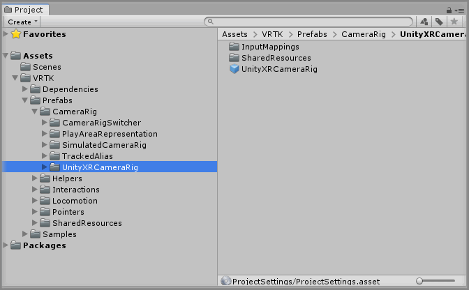
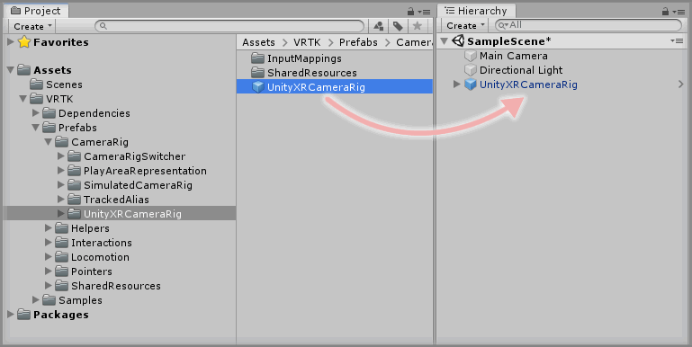
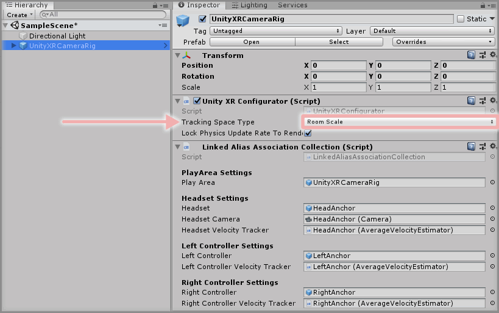
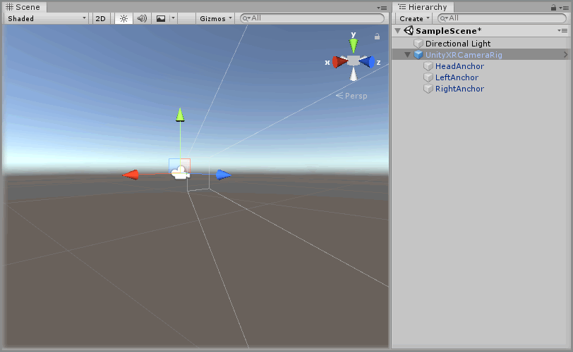

&gt; [首页](../../../../README.md) &gt; [操作指南](../../README.md) &gt; [CameraRigs](../README.md)

# 添加 UnityXRCameraRig

> * 水平: 初学者
>
> * 阅读时间: 2 分钟
>
> * 提交版本: Unity 2018.3.10f1

## 介绍

UnityXR CameraRig 预制体提供了一个跟踪HMD旋转和位置的摄像头以及任何可用的XR控制器。

这一部分的目的是学习如何将UnityXR CameraRig预制体添加到场景中，并对其进行关于跟踪空间类型方面的配置。

## 相关定义

* `HMD` - 头戴式显示器，通常指代的是VR/AR头显。
* `CameraRig` - 一个包含了表示头显和控制器的游戏对象。
* `6 degrees of freedom` - 能够在3个旋转轴（X、Y、Z）和3个方向轴（X、Y、Z）上被追踪的现实世界的对象，也称为房间尺度追踪（Room Scale Tracking）。
* `3 degrees of freedom` - 仅在3个旋转轴（X、Y、Z）上被追踪的现实世界的对象，也称为静止跟踪。

## 预备内容

* 按照《VRTK 入门》一节的步骤将VRTK添加到你的Unity项目中。

## 开始

### 第一步

根据路径 `VRTK -> Prefabs -> CameraRig -> UnityXRCameraRig`依次展开VRTK的目录，可以看到`UnityXRCameraRig`文件夹下包含的内容。

### 第二步

选择`UnityXRCameraRig`预制体并将其拖入到Hierarchy面板中。

删除场景中的 `Main Camera` 游戏对象，因为 `UnityXRCameraRig` 预制体已经包含了一个场景所需的 Main Camera组件。

### 第三步

选择已经在场景中的 `UnityXRCameraRig` 游戏对象，然后设置`Unity XR Configurator`组件的属性，以符合你的跟踪空间要求。

* `Tracking Space Type` 类型解释如下：
  * `Room Scale` 适用于支持6自由度追踪的XR设备（能够在游玩区域自由移动）。
  * `Stationary` 适用于支持3自由度追踪的XR设备（只有环顾四周但不能在游戏区域内移动）。

### 完成

现在UnityXR CameraRig已经存在于场景当中，如果此时点击播放按钮，你将看到HeadAnchor上的Camera会追踪XR头显，另外，此时如果开启了XR控制器手柄，将能看到UnityXR CameraRig下的Left或Right Anchor游戏对象同样追踪了它们。

## 相关阅读

* [添加 TrackedAlias](../AddingATrackedAlias/README.md)

[VRTK 入门]: https://github.com/ExtendRealityLtd/VRTK#getting-started